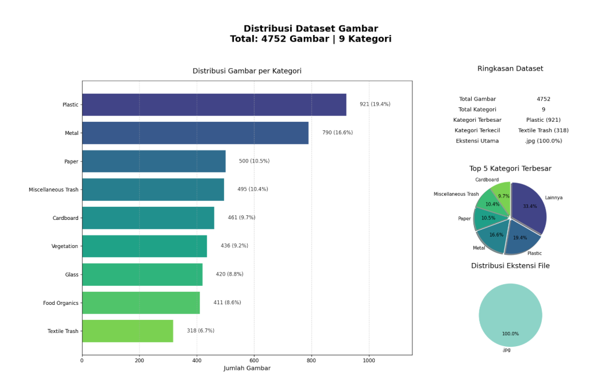
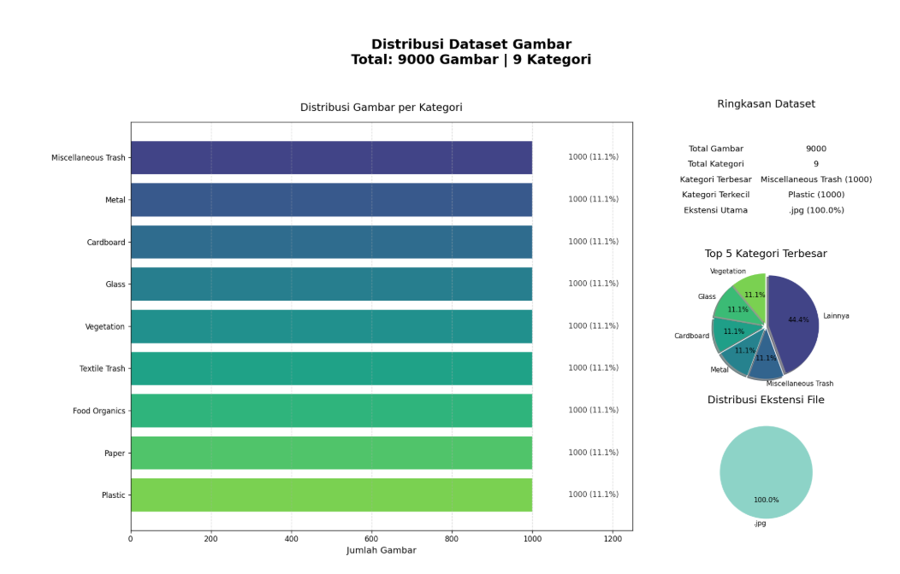
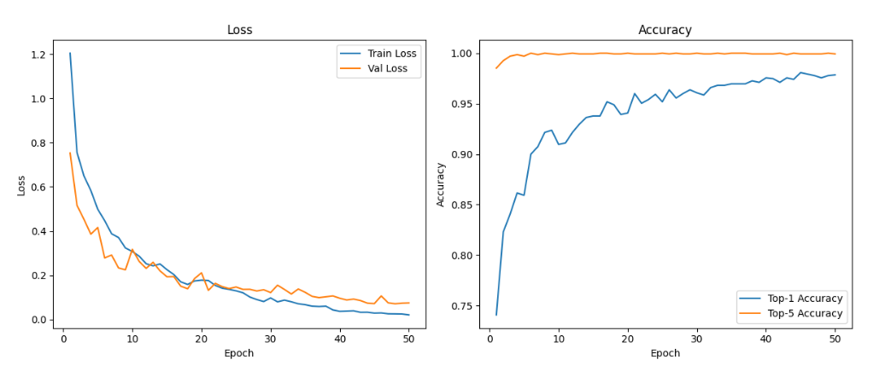
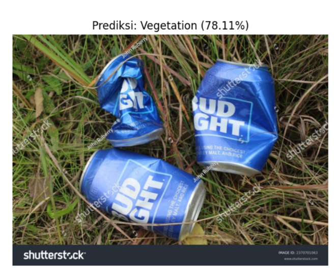

# EcoSort: AI-Powered Waste Classification & Recycling Guide

## Ringkasan Eksekutif

EcoSort adalah platform web berbasis AI yang mengatasi masalah pengelolaan sampah di Indonesia, khususnya sampah plastik yang belum terkelola dengan baik. Proyek ini bertujuan meningkatkan akurasi pemilahan sampah dan partisipasi daur ulang masyarakat. Kami memanfaatkan model **Convolutional Neural Network (CNN)**, diperkuat dengan **YOLO RealWaste**, untuk mengklasifikasikan 6 jenis sampah utama (plastik multilayer, kertas, logam, kaca, organik, B3) dengan target akurasi $\\geq 85%$. EcoSort juga dilengkapi **panduan daur ulang spesifik** dan **integrasi peta bank sampah** (bekerja sama dengan Waste4Change) untuk memudahkan penyaluran sampah. Proyek ini sejalan dengan target pengurangan sampah plastik KLHK 2024–2025.

---

## Domain Proyek

### Latar Belakang

Indonesia menghadapi masalah serius dengan 7,8 juta ton sampah plastik per tahun, di mana sebagian besar tidak dikelola dengan baik. Ada kesenjangan besar antara pengetahuan masyarakat akan pentingnya pemilahan sampah dan praktiknya ($19,49%$ yang benar-benar memilah). Ini berdampak buruk pada lingkungan dan keberlanjutan.

### Solusi dan Referensi

EcoSort hadir untuk mengatasi masalah ini dengan:

1. **AI untuk Klasifikasi Akurat:** Meminimalkan kesalahan pemilahan sampah di sumbernya.
2. **Mendorong Partisipasi:** Memberi panduan daur ulang dan info lokasi bank sampah terdekat.
3. **Mendukung Ekonomi Sirkular:** Meningkatkan kualitas daur ulang.

Proyek ini terinspirasi dari laporan **National Plastic Action Partnership (NPAP, 2021)** dan **World Economic Forum (2023)** tentang AI dalam ekonomi sirkular, serta survei **Katadata (2023)** yang menunjukkan kurangnya pemahaman masyarakat tentang pemilahan sampah. Kami juga mendukung target **KLHK (2024–2025)**.

---

## Business Understanding

### Pernyataan Masalah

1. **Sampah Tak Terkelola:** Tingginya volume sampah plastik dan rendahnya tingkat daur ulang efektif ($12%$).
2. **Salah Pilah Sampah:** Pemilahan yang tidak akurat di tingkat rumah tangga menyebabkan kontaminasi tinggi ($60%$ di TPA Surabaya).
3. **Kurang Praktik:** Meski sadar, hanya sedikit masyarakat yang benar-benar memilah sampah.

### Tujuan

1. Membuat model CNN akurat ($\\geq 85%$) untuk klasifikasi 6 jenis sampah khas Indonesia.
2. Mengembangkan platform web dengan panduan daur ulang dan peta bank sampah untuk meningkatkan partisipasi.
3. Meningkatkan kesadaran dan praktik pemilahan sampah di masyarakat.

### Pernyataan Solusi

Kami memiliki dua pendekatan solusi:

1. **Pengembangan Model AI Klasifikasi Sampah (CNN & YOLO):**
   - **Baseline:** Menggunakan CNN biasa, diukur dengan **akurasi klasifikasi**.
   - **Peningkatan:** Mengintegrasikan **YOLO** dengan dataset **RealWaste** untuk deteksi objek _real-time_ yang lebih cepat dan akurat. Ini akan diukur dengan **mAP (mean Average Precision)** dan akurasi.
2. **Integrasi Platform Web:**
   - **Panduan Daur Ulang:** Menyediakan instruksi spesifik berdasarkan jenis sampah.
   - **Peta Bank Sampah:** Menampilkan lokasi bank sampah terdekat via Google Maps API dan data Waste4Change. Keberhasilan diukur dari **tingkat penggunaan fitur peta** dan **peningkatan kunjungan ke bank sampah**.

---

## Data Understanding

### 1. Informasi Data

Kami menggunakan kombinasi dataset **TrashNet**, **gambar sampah lokal Indonesia** ($\\geq 200$ gambar), dan **RealWaste**.

**RealWaste Dataset** memiliki 9 kategori sampah dengan jumlah gambar bervariasi:

- Cardboard: 461
- Food Organics: 411
- Glass: 420
- Metal: 790
- Miscellaneous Trash: 495
- Paper: 500
- Plastic: 921
- Textile Trash: 318
- Vegetation: 436

**Kondisi Data:** Gambar bervariasi dalam pencahayaan dan sudut, memerlukan preprocessing.

### 2. Sumber Data

- **RealWaste Dataset:** [https://www.kaggle.com/datasets/joebeachcapital/realwaste]

### 3. Variabel/Fitur Data

Input data adalah **gambar**, dengan **label** kategori sampah (misalnya, Plastik Multilayer, Kertas, Logam, Kaca, Organik, B3, serta kategori dari RealWaste).

## Exploratory Data Analysis (EDA)

### 1. List jumlah label dan gambar

- **Mendaftar dan Menghitung Gambar per Folder:** Fungsi `list_image_folders` akan digunakan untuk menampilkan berapa banyak gambar di setiap folder (kategori) sampah dalam dataset. Ini membantu kita melihat distribusi data antar kategori.
- **Visualisasi Jumlah Gambar per Kategori:** Setelah menghitung, data ini akan divisualisasikan dalam bentuk **diagram batang** (`sns.barplot`). Ini akan memberikan gambaran visual tentang jumlah gambar yang tersedia untuk setiap jenis sampah, membantu mengidentifikasi potensi ketidakseimbangan data (misalnya, kategori dengan gambar terlalu sedikit).

Kami telah menganalisis struktur dataset RealWaste dan mengidentifikasi **9 kategori sampah** yang berbeda: **Cardboard, Food Organics, Glass, Metal, Miscellaneous Trash, Paper, Plastic, Textile Trash, dan Vegetation**.

Berikut adalah rincian jumlah gambar untuk setiap kategori yang ditemukan:

- **Cardboard:** 461 gambar
- **Food Organics:** 411 gambar
- **Glass:** 420 gambar
- **Metal:** 790 gambar
- **Miscellaneous Trash:** 495 gambar
- **Paper:** 500 gambar
- **Plastic:** 921 gambar
- **Textile Trash:** 318 gambar
- **Vegetation:** 436 gambar

**Total keseluruhan gambar dalam dataset ini adalah 4752.**

### 2. Cek Resolusi Gambar

Fungsi yang kami gunakan akan **memindai setiap gambar** di seluruh dataset. Hasilnya akan menunjukkan **resolusi unik yang ditemukan** beserta **jumlah gambar** untuk setiap resolusi tersebut.

Pengecekan resolusi pada dataset RealWaste menunjukkan hasil yang seragam:

- **Semua 4752 gambar** dalam dataset memiliki **resolusi yang sama, yaitu (524, 524) piksel.**

### 3. Sampel Gambar

Untuk mendapatkan gambaran visual dari dataset, kami menampilkan **sampel gambar dari setiap kategori sampah**. Ini membantu kami melihat secara langsung seperti apa data yang akan dilatih oleh model.

Kami menggunakan fungsi khusus untuk memilih dan menampilkan **4 gambar acak** dari masing-masing dari 9 kategori sampah yang ada di dataset RealWaste. Hasil visualisasi ini disimpan sebagai `preview.png`.

**Tujuan visualisasi sampel ini adalah:**

- Memahami variasi visual antar kategori (misalnya, bentuk, warna, tekstur sampah).
- Mendeteksi anomali atau gambar yang tidak relevan jika ada.
- Memastikan bahwa data yang akan digunakan relevan dengan masalah klasifikasi sampah.
  Tentu, mari kita ringkas lagi agar lebih mudah dipahami dan fokus pada poin-poin penting.

---

### 4. Distribusi Gambar per Kategori

Untuk memahami komposisi dataset secara menyeluruh, kami menganalisis **distribusi gambar di setiap kategori sampah**. Ini penting untuk mengidentifikasi kategori yang mungkin memiliki data lebih sedikit atau lebih banyak, yang bisa memengaruhi kinerja model kami.

jenis file gambar yang dominan.

Visualisasi di atas menunjukkan distribusi dataset gambar RealWaste:

- **Total Data:** Dataset ini berisi **4752 gambar** yang terbagi dalam **9 kategori** sampah.
- **Distribusi Kategori:**
  - **Kategori Terbesar:** `Plastic` (921 gambar, 19.4% dari total) dan `Metal` (790 gambar, 16.6%).
  - **Kategori Terkecil:** `Textile Trash` (318 gambar, 6.7%) dan `Food Organics` (411 gambar, 8.6%).
  - Ada **ketidakseimbangan data** yang perlu diperhatikan, dengan `Plastic` hampir tiga kali lipat lebih banyak dari `Textile Trash`.

**Kesimpulan:** Dataset ini memiliki variasi jumlah gambar antar kategori. Ini mengindikasikan perlunya strategi seperti **augmentasi data** atau teknik penanganan **imbalanced data** untuk memastikan model belajar secara efektif dari semua kategori, terutama yang memiliki jumlah gambar lebih sedikit.

---

---

---

### 5. Augmentasi Data (Offline Augmentation)

Setelah menganalisis distribusi data, kami menemukan bahwa beberapa kategori sampah memiliki jumlah gambar yang lebih sedikit. Untuk mengatasi ketidakseimbangan ini dan meningkatkan kemampuan model untuk belajar, kami melakukan **augmentasi data secara offline**.

**Tujuan Augmentasi:**

- **Menambah jumlah gambar** untuk kategori yang kurang representatif.
- **Meningkatkan variasi data** pelatihan, membuat model lebih tangguh terhadap variasi di dunia nyata.

**Proses Augmentasi:**
Kami menargetkan **minimal 1000 gambar** untuk setiap kategori. Kategori dengan jumlah gambar di bawah 1000 akan di-augmentasi menggunakan teknik seperti:

- **Horizontal Flip:** Membalik gambar secara horizontal.
- **Rotasi Acak (10 derajat):** Memutar gambar sedikit.
- **Color Jitter:** Mengubah kecerahan, kontras, dan saturasi gambar.
- **Random Resized Crop:** Memotong bagian acak dari gambar dengan ukuran yang sama.

---

---

#### **Distribusi Data Setelah Augmentasi**

Gambar di atas menunjukkan distribusi dataset setelah proses augmentasi.

- **Total Gambar:** Kini ada **9000 gambar** yang tersebar di **9 kategori**.
- **Distribusi Merata:** Setiap kategori (Plastic, Paper, Food Organics, Textile Trash, Vegetation, Glass, Cardboard, Metal, Miscellaneous Trash) kini memiliki **1000 gambar (11.1%)**.

**Kesimpulan:** Proses augmentasi berhasil **menyeimbangkan jumlah gambar** di setiap kategori. Dataset sekarang siap untuk pelatihan model tanpa bias yang signifikan karena ketidakseimbangan data.

---

---

### 6. Pemisahan Data (Data Splitting)

Setelah augmentasi, dataset yang sudah seimbang selanjutnya **dipisahkan menjadi tiga bagian**:

- **Data Latih (Train Set):** Digunakan untuk melatih model.
- **Data Validasi (Validation Set):** Digunakan untuk menyetel _hyperparameter_ model dan memantau performa selama pelatihan.
- **Data Uji (Test Set):** Digunakan untuk mengevaluasi performa akhir model setelah pelatihan selesai.

Kami membagi dataset dengan rasio berikut:

- **70% untuk Data Latih**
- **15% untuk Data Validasi**
- **15% untuk Data Uji**

---

## Pemodelan (Model Training)

Pada tahap ini, kami melatih model klasifikasi sampah menggunakan arsitektur **YOLOv8s-cls (small model)**.

**Detail Pelatihan:**

- **Model:** YOLOv8s-cls, yang dikenal efisien untuk tugas klasifikasi.
- **Dataset:** Dataset yang telah di-split dengan 6300 gambar latih dan 1350 gambar validasi.
- **Epochs:** Model dilatih selama **50 epoch**.
- **Ukuran Gambar (imgsz):** 640 piksel, untuk akurasi yang lebih baik.
- **Optimizer:** Menggunakan **Adam** dengan _learning rate_ awal 0.001.
- **Hardware:** Pelatihan dilakukan menggunakan GPU (device=0).

**Hasil Pelatihan Singkat:**
Setelah 50 epoch, model menunjukkan performa yang sangat baik:

- **Top-1 Akurasi:** **0.981 (98.1%)**
- **Top-5 Akurasi:** **0.999 (99.9%)**

Ini menunjukkan model kami sangat efektif dalam mengklasifikasikan jenis sampah dengan tingkat akurasi yang tinggi.

---

Here's the concise README entry for the evaluation phase:

---

## Evaluasi Model

Setelah pelatihan, model terbaik dievaluasi menggunakan **data uji (test set)** yang belum pernah dilihat model sebelumnya. Ini penting untuk mengukur performa model di skenario dunia nyata.

- **Model yang Digunakan:** Model `best.pt` dari hasil pelatihan YOLOv8s-cls.
- **Data Uji:** Kami menggunakan 1350 gambar dari set data uji yang telah dipisahkan sebelumnya.

**Hasil Evaluasi:**

- **Accuracy Top-1 (Akurasi Utama):** **0.985 (98.5%)**
- **Accuracy Top-5:** **1.0 (100%)**

**Kesimpulan:** Model berhasil mengklasifikasikan sampah dengan **akurasi yang sangat tinggi ($98.5\%$)** pada data yang belum pernah dilihatnya. Ini menunjukkan bahwa model sangat andal untuk tugas klasifikasi sampah di proyek EcoSort.

---

### **Visualisasi Metrik Pelatihan**

Grafik di atas menunjukkan performa model selama 50 _epoch_ pelatihan:

- **Grafik Kiri (Loss):** Menunjukkan bahwa **Train Loss** (biru) dan **Val Loss** (oranye) terus menurun dan menyempit seiring berjalannya waktu. Ini menandakan model belajar dengan baik dan tidak mengalami _overfitting_ yang parah.
- **Grafik Kanan (Accuracy):**
  - **Top-1 Accuracy** (biru) meningkat secara konsisten dan mencapai nilai tinggi (mendekati 1.0 atau 100%).
  - **Top-5 Accuracy** (oranye) dengan cepat mencapai dan bertahan di hampir 1.0 (100%), menunjukkan model sangat baik dalam memprediksi kelas yang benar di antara 5 prediksi teratasnya.

**Kesimpulan:** Grafik ini mengkonfirmasi **pelatihan model berjalan sukses**. Model menunjukkan kemampuan belajar yang kuat dan performa yang stabil, mencapai akurasi tinggi pada data latih dan validasi.

---

### Penyimpanan dan Ekspor Model

Setelah pelatihan dan evaluasi yang sukses, model terbaik (`best.pt`) disimpan untuk penggunaan di masa mendatang dan diekspor ke berbagai format untuk kompatibilitas lintas platform.

**1. Penyimpanan Model Terbaik:**

- Model terbaik dari pelatihan YOLOv8s-cls (`runs/classify/train/weights/best.pt`) disalin dan disimpan secara terorganisir ke direktori `saved_models/` dengan nama `best_classification_model.pt`.

**2. Ekspor ke Berbagai Format:**
Model juga diekspor ke format-format populer untuk memungkinkan deployment di berbagai lingkungan:

- **ONNX (`.onnx`):** Untuk inferensi yang efisien di berbagai _runtime_ AI.
- **TorchScript (`.torchscript`):** Untuk optimasi dan deployment di lingkungan PyTorch.
- **TensorFlow Lite (`.tflite`):** Ideal untuk aplikasi seluler dan perangkat _edge_ yang memiliki sumber daya terbatas.
- **TensorFlow.js (`best_web_model`):** Untuk deployment model langsung di aplikasi berbasis web/browser.

Ekspor ke berbagai format ini memastikan model klasifikasi sampah EcoSort dapat diintegrasikan dengan mudah ke dalam berbagai aplikasi dan sistem.

---

### Inferensi (Prediksi Model)

Setelah model dilatih dan dievaluasi, tahap selanjutnya adalah melakukan **inferensi** atau prediksi pada gambar baru. Ini menunjukkan bagaimana model EcoSort akan bekerja dalam skenario praktis.

Kami menggunakan fungsi `classify_image_from_url` untuk:

- Memuat model klasifikasi terbaik yang telah disimpan (`best_classification_model.pt`).
- Mengambil gambar sampah dari sebuah URL (misalnya, gambar kaleng bekas).
- Menjalankan model untuk memprediksi kategori sampah.
- Menampilkan prediksi kelas dengan _confidence_ (tingkat keyakinan) tertinggi, serta 5 prediksi teratas beserta persentasenya.

**Contoh Hasil Inferensi:**
Saat menguji model dengan gambar kaleng bir bekas, model memprediksi:

- **Prediksi Kelas:** `Vegetation` (Vegetasi) dengan _confidence_ **0.7811 (78.11%)**.
- **Top 5 Confidence:**

  - Vegetation 78.11%
  - Paper 6.62%
  - Plastic 6.58%
  - Cardboard 4.91%
  - Metal 3.76%

    

    **Analisis Hasil:** Meskipun gambar tersebut sebenarnya adalah kaleng logam (`Metal`), model memprediksi `Vegetation` sebagai kelas dengan \*confidence\* tertinggi. Ini menunjukkan bahwa model mungkin perlu penyesuaian atau penambahan data pada kategori `Metal` agar lebih akurat dalam skenario tertentu. Namun, perlu dicatat bahwa `Metal` masuk dalam 5 prediksi teratas, yang menunjukkan model masih memiliki beberapa pemahaman terkait.

---
